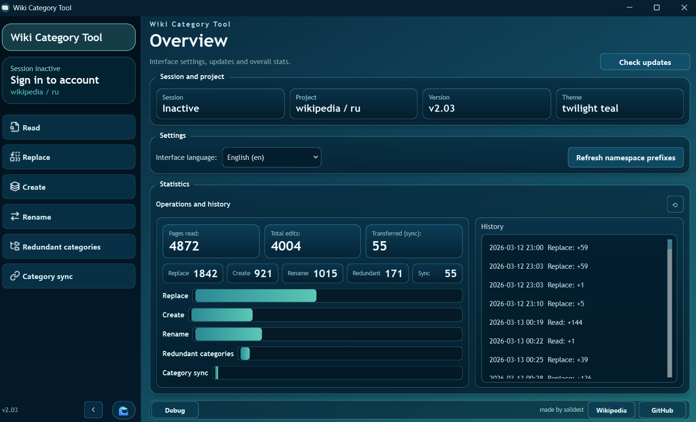
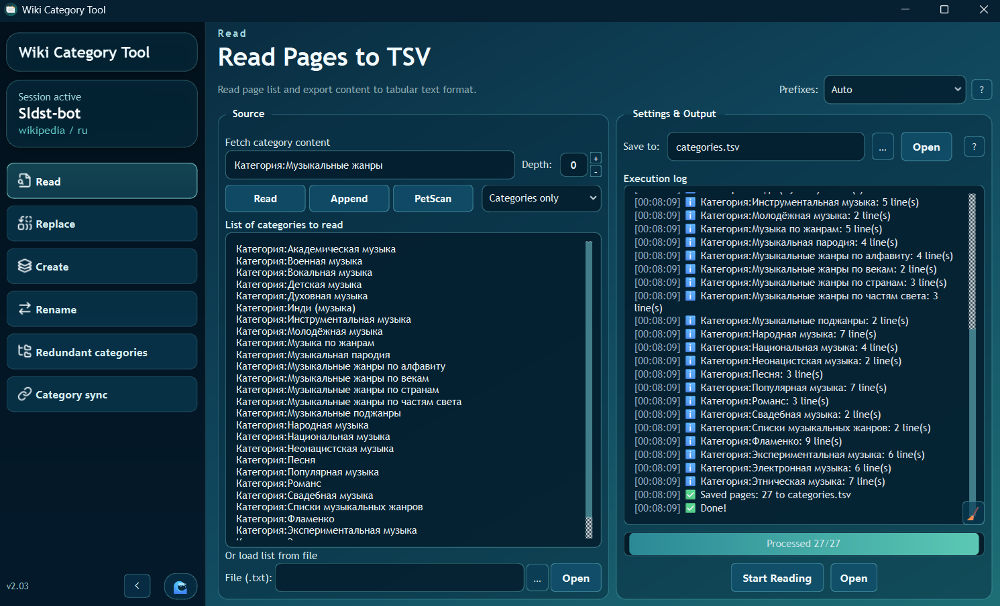
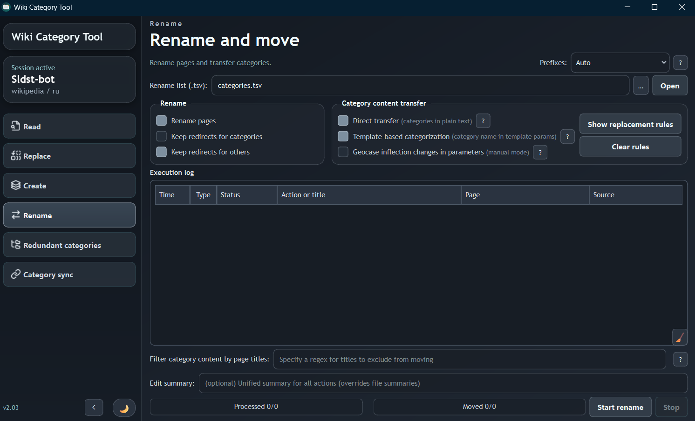
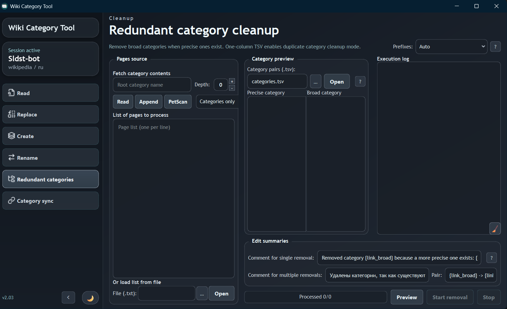
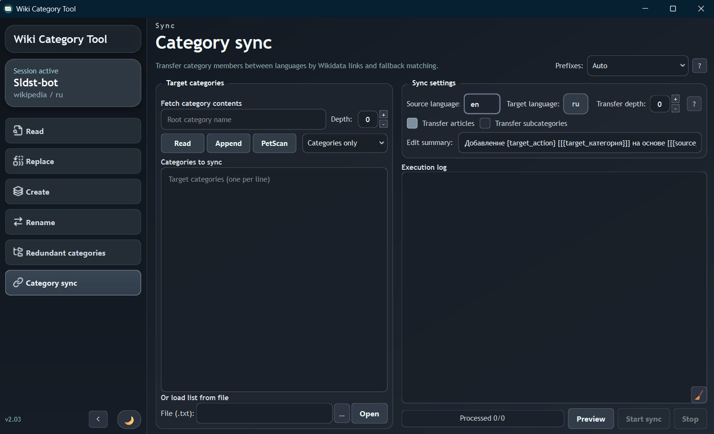

# Wiki Category Tool

> ## 🌐 [English version](README_EN.md)

[](https://github.com/sc113/wiki-category-tool/releases/latest)
[](LICENSE)
[](https://www.python.org/)

Wiki Category Tool — десктоп-приложение на `PySide6` для пакетной работы со страницами и категориями Wikimedia через `pywikibot` и MediaWiki API.

Проект ориентирован на сценарии массовой обработки TSV:

- считывание списков страниц и подкатегорий;
- массовая перезапись существующих страниц;
- массовое создание отсутствующих страниц;
- переименование страниц с переносом категорий;
- удаление избыточных категорий;
- межъязыковая синхронизация категорий.

> [Скачать последнюю версию для Windows](https://github.com/sc113/wiki-category-tool/releases/latest) или следуйте инструкции ниже для запуска из исходного кода.

## Скриншоты

### Обзор и статистика операций



<table>
  <tr>
    <td width="50%">
      <strong>Считывание страниц в TSV</strong><br>
      
    </td>
    <td width="50%">
      <strong>Переименование и перенос категорий</strong><br>
      
    </td>
  </tr>
  <tr>
    <td width="50%">
      <strong>Удаление избыточных категорий</strong><br>
      
    </td>
    <td width="50%">
      <strong>Межъязыковая синхронизация категорий</strong><br>
      
    </td>
  </tr>
</table>

---

## Основные возможности

- Авторизация в проектах Wikimedia через `pywikibot`, включая интерактивную двухфакторную авторизацию.
- Работа с пространствами имён и префиксами (`Авто` или принудительная нормализация к выбранному NS).
- Считывание содержимого страниц и категорий с экспортом в UTF-8 TSV.
- Массовая перезапись существующих и создание отсутствующих страниц.
- Переименование страниц с переносом прямых категорий и категорий в параметрах шаблонов.
- Предпросмотр и удаление широких категорий при наличии более точных.
- Удаление дубликатов целевых категорий по одноколоночному TSV.
- Межъязыковая синхронизация статей и подкатегорий через ссылки Wikidata и резервное сопоставление.
- Предпросмотр операций перед запуском записи.
- Логи выполнения, прогресс, статистика правок и история операций.
- Русский и английский интерфейс и несколько визуальных тем.

---

## Технические требования

- Python: `3.10+`
- ОС: Windows 10/11 — основной поддерживаемый и собираемый вариант
- Зависимости: `PySide6`, `pywikibot`, `requests`, `packaging`

Запуск из исходного кода на других операционных системах возможен, но основной целевой платформой остаётся Windows.

---

## Установка

```powershell
git clone https://github.com/sc113/wiki-category-tool.git
cd wiki-category-tool
python -m venv .venv
.\.venv\Scripts\Activate.ps1
python -m pip install --upgrade pip
python -m pip install -r requirements.txt
```

---

## Запуск

Из корня репозитория:

```powershell
python __main__.py
```

Если каталог репозитория доступен как пакет `wiki_cat_tool` из родительской директории:

```powershell
python -m wiki_cat_tool
```

`python main.py` использовать не рекомендуется из-за package-relative импортов.

---

## Форматы TSV

Рекомендуемая кодировка файлов — UTF-8 с BOM.

### Перезапись / Создание

```text
Title<TAB>Line 1<TAB>Line 2<TAB>...
```

- Первая колонка: заголовок страницы.
- Остальные колонки объединяются в конечный текст через переносы строк.

### Переименование

```text
OldTitle<TAB>NewTitle<TAB>Необязательный комментарий
```

- Третья колонка опциональна.
- Общий комментарий во вкладке может переопределить комментарий из TSV.

### Удаление избыточных категорий

Режим пар удаляет широкую категорию, если присутствует соответствующая точная:

```text
PreciseCategory<TAB>BroadCategory
```

Файл с одной колонкой включает режим удаления дубликатов категорий:

```text
CategoryToDeduplicate
```

---

## Вкладки интерфейса

- **Обзор** — состояние сессии, настройки интерфейса, обновления, статистика и история.
- **Считывание** — сбор страниц и подкатегорий, экспорт содержимого в TSV.
- **Перезапись** — массовое обновление существующих страниц из TSV.
- **Создание** — создание только отсутствующих страниц из TSV.
- **Переименование** — переименование и перенос категорий, включая параметры шаблонов.
- **Избыточные категории** — предпросмотр и удаление широких категорий или дубликатов.
- **Синхронизация категорий** — перенос категорий между языковыми разделами.

---

## Конфиги и runtime-данные

Папка `configs/` создаётся автоматически и может содержать:

- `user-config.py`, `user-password.py` — настройки `pywikibot`;
- `pywikibot*.lwp` — cookie-файлы;
- `template_rules.json` — правила шаблонных замен;
- `update_settings.json` — настройки проверки обновлений;
- `apicache/` — кэш API и namespace-префиксов.

Эти файлы зависят от окружения и могут содержать данные авторизации. Не публикуйте и не добавляйте их в репозиторий.

---

## Структура проекта

- `gui/` — главное окно, вкладки, диалоги и виджеты.
- `workers/` — фоновые потоки операций.
- `core/` — API-клиент, namespace manager, локализация и конфигурация.
- `locales/` — словари интерфейса (`ru-RU.json`, `en-US.json`).
- `assets/` — ресурсы интерфейса и скриншоты.
- `configs/` — runtime-состояние, создаваемое при запуске.

---

## Сборка EXE для Windows

```powershell
python -m pip install pyinstaller
pyinstaller WikiCatTool.spec
```

Результат: `dist/WikiCatTool.exe`.

---

## Практические замечания

- Перед массовыми изменениями тестируйте операции на небольшом наборе страниц.
- Учитывайте локальные правила конкретного Wikimedia-проекта.
- Проверяйте предпросмотр и комментарии к правкам перед запуском.
- Убедитесь, что у учётной записи достаточно прав для выбранной операции.

---

## Лицензия

Проект распространяется под лицензией `GPL-3.0-or-later`. Полный текст доступен в файле [LICENSE](LICENSE).
